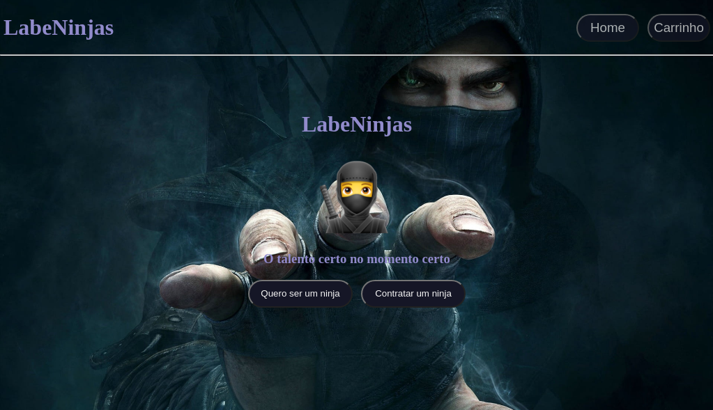
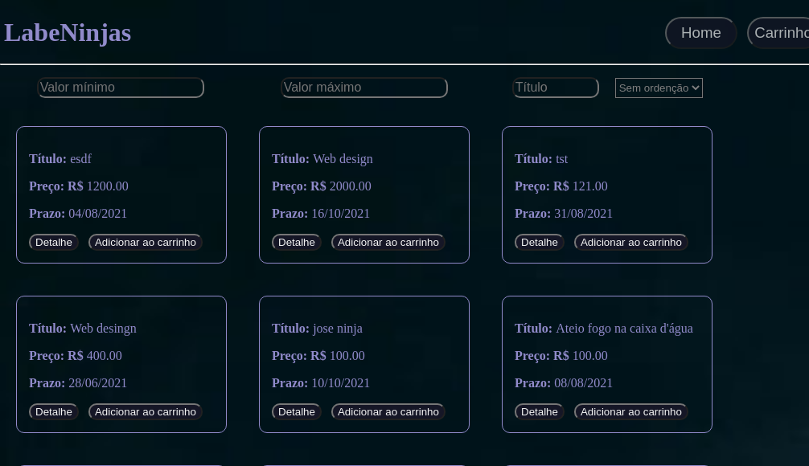

<!DOCTYPE html>
<html>
<head>
</head>
	<title></title>
<body>
	<h1>Projeto individual Ninja Marketplace</h1>
	<b>Descrição: </b>Aplicativo de contratação de serviços, exemplo com empresas e serviços fictícios. Com cadastramento do serviço à se prestar, preço e prazo para realização e formas de pagamento. Segue os detalhes.
	<ul>
		<li>Pagina inicial:
Introdução do aplicativo, com cabeçalho o qual é padronizao em todas as páginas. Esse cabeçalho leva o nome do app e dois botões, o a homepage, página atual e o botão do carrinho que lea até o carrinho do marketplace onde ficam os serviços que o usuário tem adicionado.
		 
		No corpo da página há dois botões que levam as páginas seguintes.

		</li>
		<li>Cadastro e lista de serviços:
		A página de cadastro é onde se colhe os dados para adição de um serviço no marketplace. O corpo da página também possui dois botões. O botão cadastrar o serviço que finaliza o cadastramento e outro para a página onde estão listados todos os serviços disponíveis no marketplace. 
		
		 
		A página onde estão listados os serviços também possui um filtro composto por 3 campos e um select. Onde é possível filtrar os serviços por valor e título através dos campos e ordenar por data, preço e ordem afabética de título através do select. Em cada serviço há dois botões, um para levar até o carrinho e outro para acessar os detalhes de cada serviços cadastrado.</li>
	</ul>
</body>
</html>
